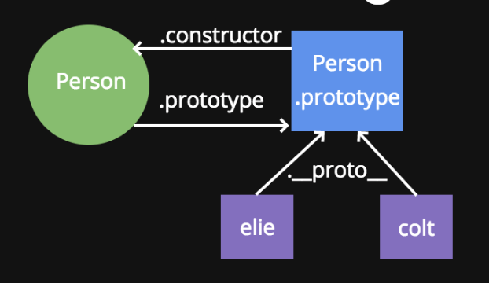
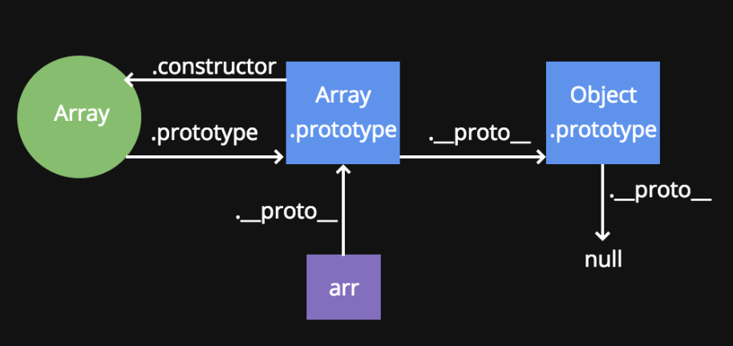

# Prototypes

### Objectives

- Understand what the prototype object is
- Describe and diagram the relationship between \_\_proto\_\_, prototype and constructor
- Add methods and properties on the prototype object to write more efficient code
- Explain the differences between adding methods and properties to the prototype versus the constructor function


### The `new` keyword
We previously used the `new` keyword to create objects from constructor functions - let's recap what it does

- Creates an object out of thin air
- Assigns the value of `this` to be that object
- Adds `return this` to the end of the function
- Creates a link (which we can access as \_\_proto\_\_) between the object created and the prototype property of the constructor function 

We're going to focus on the 4th point - let's see what that link looks like!

### A Small Diagram




- Every constructor function has a property on it called "prototype", which is an object
- The prototype object has a property on it called "constructor", which points back to the constructor function
- Anytime an object is created using the `new` keyword, a property called "\_\_proto\_\_" gets created, linking the object and the prototype property of the constructor function

### Code

Let's see that previous example in code.
```
// this is the constructor function
function Person(name){
    this.name = name;
}
```
```
// this is an object created from the Person constructor

var elie = new Person("Elie");
var colt = new Person("Colt");
// since we used the new keyword, we have established
// a link between the object and the prototype property
// we can access that using __proto__
```
```
elie.__proto__ === Person.prototype; // true
colt.__proto__ === Person.prototype; // true
// The Person.prototype object also has a property
// called constructor which points back to the function

Person.prototype.constructor === Person; // true
```

Prototype
Where does the prototype property fit into all of this? Remember, the prototype is shared among all objects created by that constructor function
```
// this is the constructor function
function Person(name){
    this.name = name;
}

// this is an object created from the Person constructor

var elie = new Person("Elie");
var colt = new Person("Colt");
```

```
Person.prototype.isInstructor = true;

elie.isInstructor; // true
colt.isInstructor; // true

// how were we able to access properties on the prototype??

// __proto__!
```

e.g. In the Chrome console
```

var arr = [];
//equal to var arr = new Array;
//Array is a built in constructor to javascript. 
undefined
arr.push(10)
1
arr
[10]0: 10length: 1__proto__: Array(0)concat: ƒ concat()constructor: ƒ Array()copyWithin: ƒ copyWithin()entries: ƒ entries()every: ƒ every()fill: ƒ fill()filter: ƒ filter()find: ƒ find()findIndex: ƒ findIndex()forEach: ƒ forEach()includes: ƒ includes()indexOf: ƒ indexOf()join: ƒ join()keys: ƒ keys()lastIndexOf: ƒ lastIndexOf()length: 0map: ƒ map()pop: ƒ pop()push: ƒ push()reduce: ƒ reduce()reduceRight: ƒ reduceRight()reverse: ƒ reverse()shift: ƒ shift()slice: ƒ slice()some: ƒ some()sort: ƒ sort()splice: ƒ splice()toLocaleString: ƒ toLocaleString()toString: ƒ toString()unshift: ƒ unshift()Symbol(Symbol.iterator): ƒ values()Symbol(Symbol.unscopables): {copyWithin: true, entries: true, fill: true, find: true, findIndex: true, …}__proto__: Object


console.dir(arr)
VM388:1 Array(1)0: 10length: 1__proto__: Array(0)

arr./_/_proto/_/_ === Array.prototype
true

```
Question: Where does the push method come from?
The answer is in Dunder proto.


### Prototype Chain
How does JavaScript find methods and properties?




### Refactoring 

Now that we know that objects created by the same constructor have a shared prototype, let's refactor some code

```
function Person(name){
    this.name = name;
    this.sayHi = function(){
        return "Hi " + this.name; 
    }
}

elie = new Person("Elie");
elie.sayHi(); // Hi Elie

// now this code works, but it is inefficient
// every time we make an object using the new keyword we have to redefine this function
// but its the same for everyone! Let's put it on the prototype instead!
```

```
function Person(name){
    this.name = name;
}

Person.prototype.sayHi = function(){
    return "Hi " + this.name; 
}

elie = new Person("Elie");
elie.sayHi(); // Hi Elie

// Muchhh better
```
### Your turn!
- Create a constructor function for a Vehicle: every object created from this constructor should have a make, model, and year property. Each object should also have a property called isRunning, which should be set to false
 
- Every object created from the Vehicle constructor should have a function called turnOn, which changes the isRunning property to true
 
- Every object created from the Vehicle constructor should have a function called turnOff, which changes the isRunning property to false
 
- Every object created from the Vehicle constructor should have a method called honk, which returns the string "beep" ONLY if the isRunning property is true

### Solution
```
function Vehicle(make, model, year){
	this.make = make;
	this.model = model;
	this.year = year;
	this.isRunning = false;
}

Vehicle.prototype.turnOn = function() {
	this.isRunning = true;
}

Vehicle.prototype.turnOff = function() {
	this.isRunning = false;
}

Vehicle.prototype.honk = function() {
	if(this.isRunning){
		return "beep!";
	} else {
		return "Nothing happened...";
	}
}

var car1 = new Vehicle();
car1.honk();
car1.turnOn();
car1.honk();
car1.turnOff();
car1.honk();
```

### Recap
- Every time the 'new' keyword is used, a link between the object created and the prototype property of the constructor is established - `this` link can be accessed using \_\_proto\_\_
- The prototype object contains a property called constructor, which points back to the constructor function
- To share properties and methods for objects created by a constructor function, place them in the prototype as it is the most efficient


